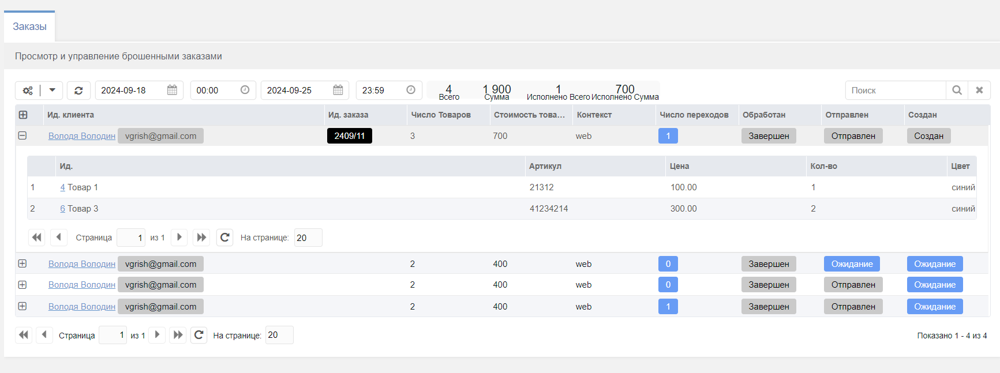

# lost-orders-ms2

# Пакет реализует функционал брошенных заказов для магазина MiniShop2 MODX Revolution V.2



Находится в разработке, версии могут не обладать обратной совместимостью. Список изменений можно найти
в [Changelog](CHANGELOG.md).

## Установка пакета
```
composer require vgrish/lost-orders-ms2 --update-no-dev
composer exec lost-orders-ms2 install
```

## Удаление пакета
```
composer exec lost-orders-ms2 remove
composer remove vgrish/lost-orders-ms2
```

## Особенности
Работает только с сессиями в базе данных, используйте `modSessionHandler` или его аналог.

### Настройки

* `lifetime_order` - время жизни брошенного заказа, по умолчанию `1m` - 1 месяц. Доступны (y - год, m - месяц, w - неделя, d - день, h - час, i - минуты).
* `min_time_order_waiting` - минимальное время ожидания (в секундах) брошенного заказа, по умолчанию `30i` - 30 минут.
* `max_time_order_waiting` - максимальное время ожидания (в секундах) брошенного заказа. по умолчанию `2h` - 2 часа.
* `max_in_day_count` - максимальное кол-во брошенных заказов в день на один идентификатор сессии `session_id`.

* `session_class` - класс объекта сессии, если не указан используется `modSession`.
* `action_url` - ссылка на коннектор обработки перехода к брошенному заказу, по умолчанию `http://sitename.ru/assets/components/lost-orders-ms2/action.php`
* `return_id` - идентификатор ресурса на который будет перекинут пользователь после коннектора.

* `grid_order_period` - период выборки заказов в админке сайта, по умолчанию `1w` - 1 неделя.
* `grid_order_fields` - список полей для вывода в таблице заказов.
* `grid_order_cart_fields` - список полей для вывода в таблице товаров заказа.
* `notice_subject` - тема оповещения.
* `notice_body` - тело оповещения. Можно указать в виде файлового чанка `@FILE chunks/email/notice.body.tpl`

